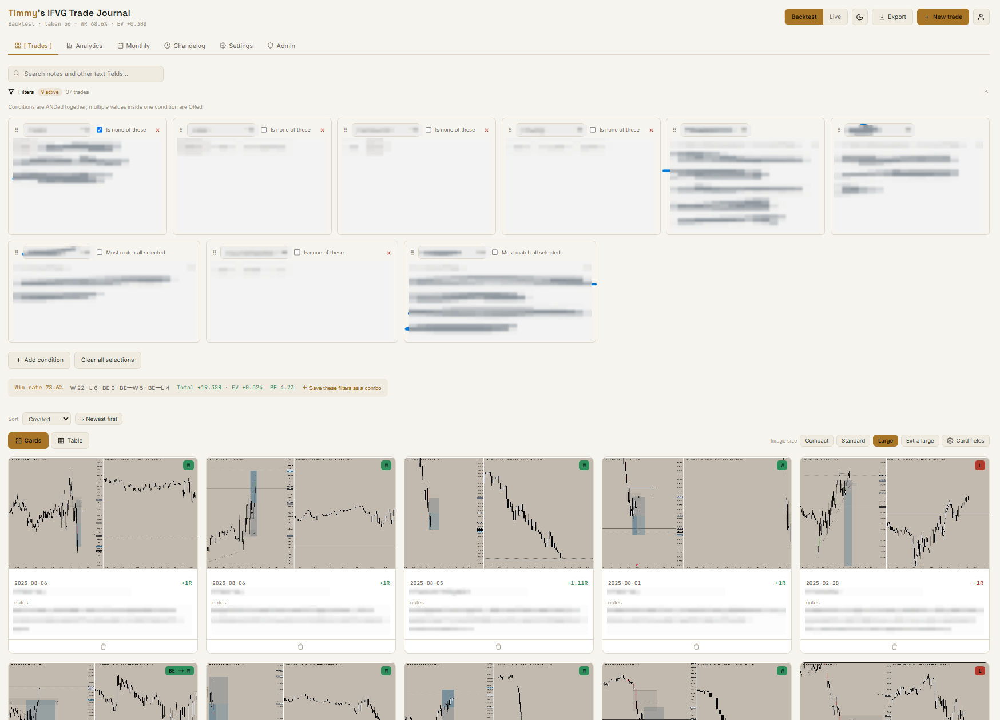
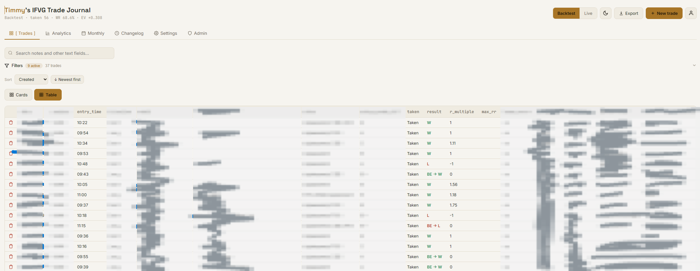
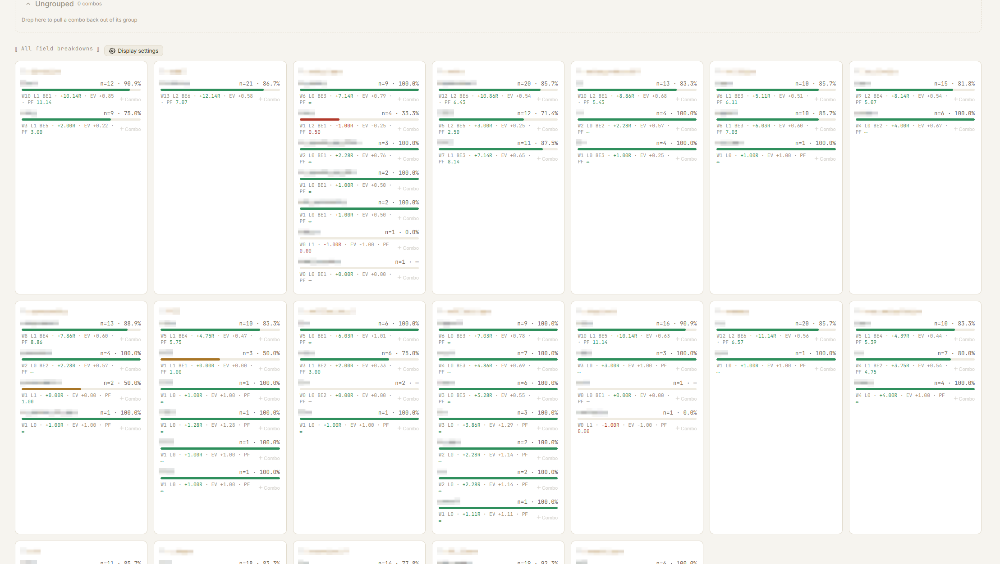
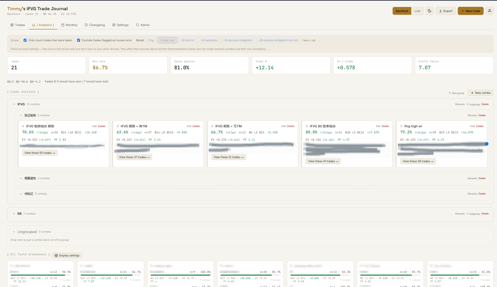
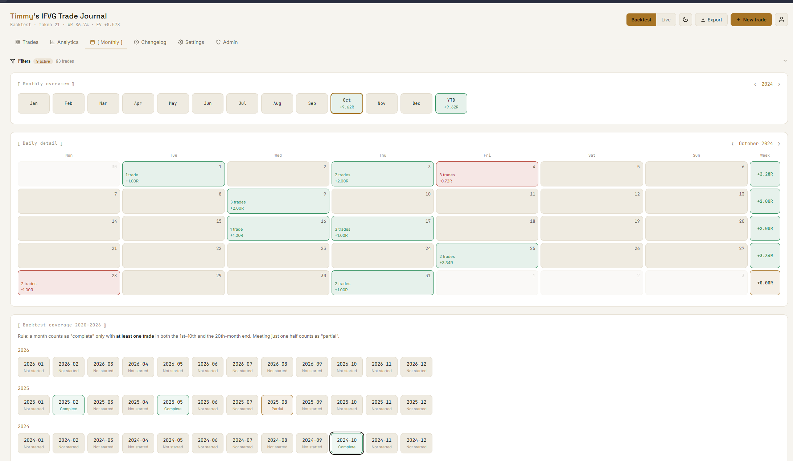
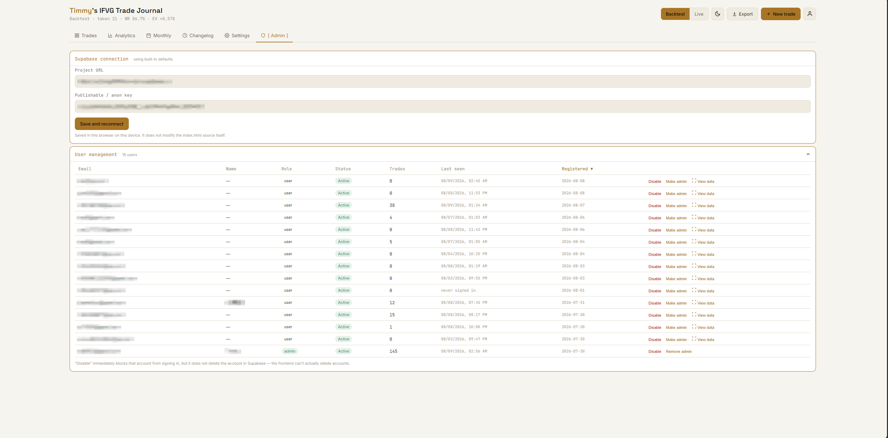

<h1 align="center">IFVG Trade Journal</h1>

<p align="center">
  A self-hosted, multi-user trading journal for traders who want their own schema —
  not whatever fields someone else's SaaS decided on.
</p>

<p align="center">
  <b>English</b> · <a href="README.zh-CN.md">简体中文</a>
</p>

<p align="center">
  
  
  
  
</p>

<!-- SCREENSHOT — hero shot (the records view with cards). Drop the file at docs/screenshots/hero.png, then delete the comment markers around the line below.
<p align="center"></p>
-->

---

## What this is

A web app for logging trades and finding out which of your own setups actually make money.

Every user gets their own field schema, their own trades, and their own analytics
configuration. Nothing is hardcoded to one trading model — the app was built around
the IFVG model, but every field, option and label is user-editable, and the analytics
engine identifies fields by the **role** you assign them, never by their name. Rename
"RR" to "R multiple" to "収益率" and every statistic keeps working.

Two fully separated data sets per account (**Backtest** and **Live**) let you build a
backtest sample of hundreds of trades without polluting your real track record.

**Key ideas**

- **Your schema, not ours** — add/remove/reorder fields, edit their type and option pool.
- **Roles over names** — the statistics engine looks for `result`, `r_multiple`, `taken`… roles.
- **Saved combos** — freeze a set of filter conditions ("Model = IFVG **and** target contains BSL"),
  name it, and watch its win rate / EV / profit factor live, next to the global baseline.
- **One consistent number everywhere** — filter bar, analytics page and combo cards share the
  same computation path, so the numbers can't drift apart.
- **Zero backend code of your own** — the browser talks to Supabase directly; row-level
  security in Postgres is the access control layer.

---

## Feature tour

### Records

<!-- SCREENSHOT — records view, table mode with the filter panel open → docs/screenshots/records.png
<p align="center"></p>
-->

- **Card view** with 4 image sizes (compact / standard / large / huge) and a picker for which
  extra fields appear on the card. Date, model and R are always shown.
- **Table view** — every field as a column, 25 rows per page.
- **Full-text search** across text and textarea fields (notes, review notes…).
- **Filtering** — multiple fields combined with AND; multiple values inside one field
  combined with OR (switchable to AND for multiselect fields); invert a condition; date
  and time ranges; "contains" matching for text. Filter cards are drag-reorderable, and the
  filter state is persisted locally and shared between the Records and Monthly pages.
- **Live filter summary** — win rate, W/L/BE counts, total R, EV and profit factor for the
  current result set, plus a one-click "save this filter as a combo".
- **Sorting** by trade date / created / updated, ascending or descending.
- **Draft protection** — a half-filled *new* trade is saved to local storage, so closing the
  tab by accident doesn't lose it. (Edits to existing trades are not drafted, by design.)
- Screenshot URLs per trade, lazy-loaded thumbnails, click for a full-size lightbox.

### Analytics

<!-- SCREENSHOT — analytics overview + field breakdowns → docs/screenshots/analytics.png
<p align="center"></p>
-->

**Overview tiles**

| Metric | Definition | Notes |
| --- | --- | --- |
| Trades | count in the current scope | labelled "Taken" when the Taken-only scope is on |
| Win rate | `W / (W + L)` | BE variants are deliberately **not** in the denominator |
| Setup quality | `(W + BE→W) / (W + L + BE→W + BE→L)` | how often the idea was right, regardless of management |
| Total R | `Σ R` | |
| EV / trade | `Σ R / trades` | denominator counts every in-scope trade, including blank R |
| Profit factor | `Σ positive R / \|Σ negative R\|` | only trades with an R actually filled in; shows `∞` when there are no losses |
| R capture | `Σ R / Σ Max RR` | needs both the `r_multiple` and `max_rr` roles |

**Statistical scope** — two independent switches, *"count only trades I actually took"* and
*"exclude trades flagged as human error"*, plus an optional per-model filter. They apply to
both the overview tiles and the field breakdowns (but never to combos, which carry their own
conditions). Scope and model filters are per-device local settings; breakdown and combo
configuration syncs through the database.

**Field breakdowns** — every select/multiselect field is broken down by value, with win rate,
sample size, W-L-BE, total R and EV per value. The `result` field is excluded (breaking down
results by result is circular). Hide the fields you don't care about, drag the rest into the
order you want; new fields you add later automatically appear at the end instead of being
swallowed by a stale whitelist.

**Combos**

<!-- SCREENSHOT — combo cards inside groups → docs/screenshots/combos.png
<p align="center"></p>
-->

A combo is a saved, named set of filter conditions with live statistics: win rate, n,
W-L-BE, total R, EV and profit factor, each shown together with its **delta against the
same-scope global baseline** (`+9.2pp`). Small samples are labelled (`n < 10`).

- Tag a combo as **"do this"** or **"avoid this"**.
- Three ways to create one: from the analytics page, from the Records filter bar
  ("save current filter as combo"), or from the `+combo` button on any breakdown row.
- **Groups and subgroups** — organise combos into a two-level tree (e.g. `IFVG → do / avoid`),
  collapsible, drag-and-drop between groups and drag-reorderable. Ignore groups entirely and
  it stays a flat list.
- Click a combo to jump to the Records page showing exactly the trades it matched.
- **Broken-reference guard** — if a combo references a field or option you later deleted, it is
  flagged in red and its statistics are disabled, instead of silently degrading into
  "matches every trade" and quietly looking great.

### Monthly

<!-- SCREENSHOT — month bar + daily heatmap → docs/screenshots/calendar.png
<p align="center"></p>
-->

- **Year bar** — 12 months plus a YTD cell, coloured by R, click to jump to a month.
- **Daily heatmap** — Monday-first calendar, per-day trade count and R, colour-coded, with a
  **weekly total column** on the right. Click a day for its trade list (thumbnails, result,
  R), open a trade from there, delete one, or create a new trade pre-dated to that day.
- **Historical backtest coverage** (backtest mode only) — 2020 to the current year, month by
  month, marked *complete / partial / not started*. A month counts as complete when both the
  1st–10th and the 20th–end-of-month windows contain at least one record, so you can see at a
  glance where your backtest sample has holes.
- The Records page filters apply here too.

### Settings

Manage the field schema: rename fields, change their type, edit the option pool
(drag-to-reorder), assign an analysis role, delete, and drag whole fields into a new order.
Changes take effect immediately in the entry form and across all statistics.

**Field types:** `text` · `textarea` · `number` · `date` · `time` · `select` · `multiselect` · `url`

**Analysis roles** — assign at most one field to each; this is the only thing the statistics
engine looks at, so field names are yours to choose freely:

| Role | Used for |
| --- | --- |
| `date` | calendar, monthly coverage, sorting |
| `model` | per-model breakdown and the model filter |
| `taken` | `Taken` / `Faded` — drives the "only what I took" scope |
| `result` | `W` / `L` / `BE` / `BE -> W` / `BE -> L` — required for any analytics at all |
| `r_multiple` | total R, EV, profit factor |
| `max_rr` | R capture rate (optional) |
| `human_error` | the "exclude human error" scope |
| `screenshot` | card thumbnails and the lightbox |

### Account

Email + password sign-up and sign-in, optional "stay signed in" (switches the session store
between `localStorage` and `sessionStorage`), change password with current-password
verification, custom display name (used in the page title) and gender.

### Language

English and Chinese, switchable from the top of the Settings tab **and** from the sign-in
screen (so you can pick a language before you have an account). First visit picks a language
from `navigator.language`; after that the choice is stored on your profile, so signing in on
another device gets the same language.

Two things are deliberately *not* translated:

- **Your field names.** A new account's default fields are seeded in whatever language was
  active at signup — `Date` / `Session` / `Entry Time` in English, `日期` / `交易时段` /
  `入场时间` in Chinese. After that they're your data. Switching language changes the
  interface around them but never rewrites labels you may have renamed. To change them,
  edit the fields in Settings.
- **Option values** (`London`, `Taken`, `W`/`L`/`BE`, …). These are stored in the database
  and shared by both languages, so statistics stay comparable no matter which language a
  trade was entered in.

Language sync needs one migration — see [docs/i18n-migration.sql](docs/i18n-migration.sql).
Without it the app still works and remembers your language per browser; it just won't follow
you across devices.

### Admin panel *(admin role only)*

<!-- SCREENSHOT — admin user table → docs/screenshots/admin.png
<p align="center"></p>
-->

- Supabase connection override, stored per browser (never writes back to the source files).
- **User management** — disable/enable an account (a disabled user is kicked out on next
  load), grant/revoke admin, and a sortable table of trade count, last seen and signup date.
- **Read-only inspection of any user's data** — browse someone else's trades, schema and
  analytics without touching your own session or local settings; exiting restores your state.
- Publish and delete changelog entries, which every signed-in user sees on the Changelog tab.

### Everything else

Dark and light theme, CSV export, JSON backup export, lazy-loaded images, `Esc` closes the
topmost modal or lightbox, responsive layout.

---

## Tech stack

| Layer | Choice |
| --- | --- |
| Frontend | Static files — `index.html` + `style.css` + `i18n.js` + `app.js`. No framework, no bundler, no build step. |
| Backend | [Supabase](https://supabase.com) (Postgres + Auth), called directly from the browser via `supabase-js`. |
| Hosting | Any static host. `vercel.json` + `build.js` are included for Vercel. |

**Architecture in three sentences.** All state lives in module-level `let` variables; mutating
state and calling `render()` regenerates an HTML string into `#app`. All interaction goes
through `data-action="…"` attributes and a handful of delegated listeners on `document`,
rather than per-element handlers. Modals render into `#modalRoot` / `#secondaryModalRoot` and
have re-render guards so a background refresh can never wipe out something you're typing.

If you plan to contribute, read [PROJECT_HANDOFF.md](PROJECT_HANDOFF.md) first — it documents
the conventions, the traps (notably: **never wrap a container that holds buttons in
`stopPropagation()`** — it silently kills every child action) and the post-change checks.

### Data model

| Table | Purpose |
| --- | --- |
| `profiles` | one row per user — email, role (`user`/`admin`), active flag, display name, gender, language, last seen. Created automatically by a signup trigger. |
| `trades` | one row per trade — `mode` (`backtest`/`live`) plus a `jsonb` `data` blob keyed by field id, so adding a field never needs a migration. |
| `journal_schema` | per-user config — `fields` (the schema), `card_fields`, and `analysis_prefs` (scope defaults, breakdown order/visibility, combos, combo groups). |
| `changelog` | global, shared by all users; admin-only writes. |

Row-level security is what enforces isolation: users read and write only their own rows,
admins additionally get **read-only** access to everyone's. Privileged writes go through
`security definer` functions (`update_own_profile`, `update_own_lang`, `touch_last_seen`,
`is_admin`) so the client can never escalate its own role.

---

## Getting started

### 1. Supabase project

Create a project, then create the four tables above with their RLS policies and helper
functions. The exact structure — columns, types, policies, triggers — is documented in
[PROJECT_HANDOFF.md](PROJECT_HANDOFF.md) §3; the repository does not ship an init script, so
either build it from that document or ask the maintainer for the SQL.

If you are upgrading an existing deployment, `analysis_prefs` is added with:

```sql
alter table journal_schema add column if not exists analysis_prefs jsonb default '{}'::jsonb;
```

The app runs fine without it — the analytics page just can't persist its settings, and shows
a notice telling you to run this statement.

### 2. Run it locally

```bash
cp config.example.js config.js
```

Fill in your Project URL and anon/publishable key from **Supabase dashboard → Settings →
API**, then serve the folder over HTTP (auth won't work from `file://`):

```bash
python -m http.server 8000
```

Open <http://localhost:8000>. There is nothing to install and nothing to compile.

### 3. Deploy to Vercel

`config.js` is gitignored, so the build generates it from environment variables:

1. **Import Git Repository** → this repo → Framework Preset **Other**.
2. **Settings → Environment Variables** → add `SUPABASE_URL` and `SUPABASE_ANON_KEY`.
3. Push to the default branch; every push redeploys.

Any other static host works too — just upload the folder with a hand-written `config.js`.

---

## Security model

- The anon/publishable key in `config.js` **is designed to be public** — that's Supabase's own
  documented position. Anyone can read it from your page source; that is not a vulnerability.
- The real security boundary is the **RLS policy on every table**. When you add a table or a
  feature, the question to ask is "is the policy right?", not "is the key hidden?".
- **Never** put a `service_role` / secret key anywhere in frontend code. That key bypasses
  every RLS policy and is effectively full database access.

### Free-tier operations note

Supabase's free plan pauses a project after 7 days without database activity (data is kept,
but 90 days of continuous pause releases the infrastructure) and provides **no automatic
backups**. This project's answer is a separate private repository running a scheduled GitHub
Action that `pg_dump`s the database daily into a committed `latest-backup.sql`, which gives
both point-in-time history via git and enough activity to prevent the pause. Connect through
the **Session pooler** connection string rather than the direct connection — the direct one
prefers IPv6 and often fails from CI.

---

## Known limitations

- No automated test suite. Verification is manual plus `node --check` and a `data-action`
  cross-reference grep (see [PROJECT_HANDOFF.md](PROJECT_HANDOFF.md) §4).
- The admin "inspect another user's data, then restore my own state" path has not been fully
  exercised end to end in a real browser.
- `max_rr` has working support but is not in the default field template, so R capture rate
  stays hidden until you add that field yourself.
- `app.js` is a single large file with no module split — fine for one maintainer, friction for
  a team.
- Accounts can be disabled but not deleted from the admin panel; deleting the underlying auth
  user requires the Supabase dashboard (a frontend cannot be trusted with that).

---

## License

No open-source license is attached. All rights reserved.
