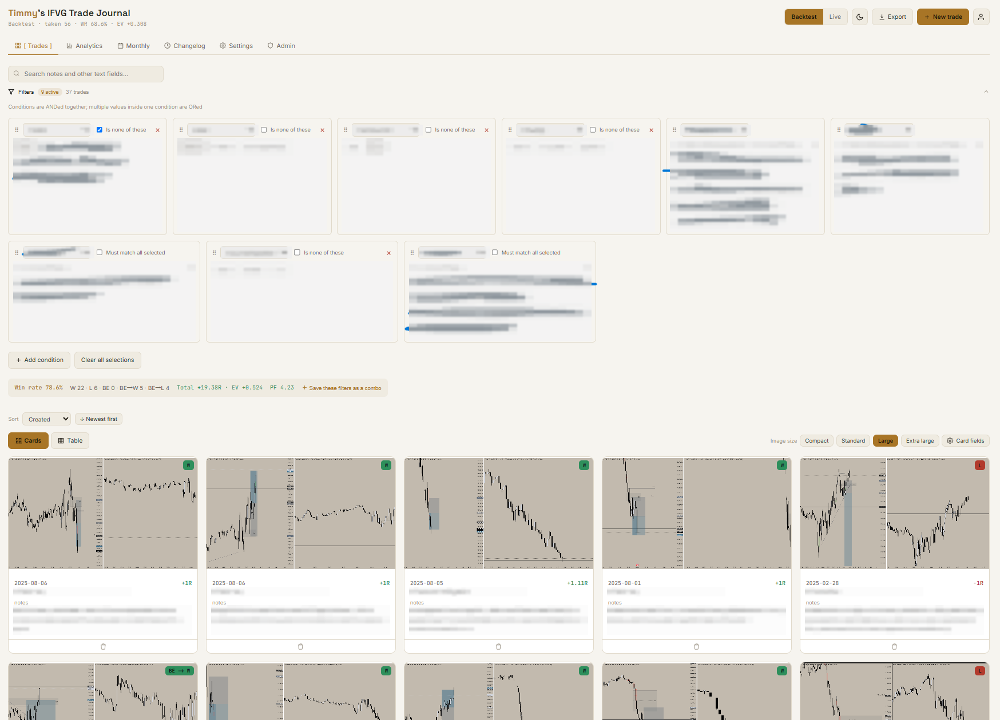
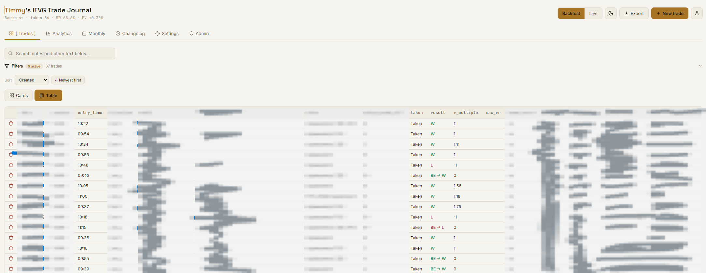
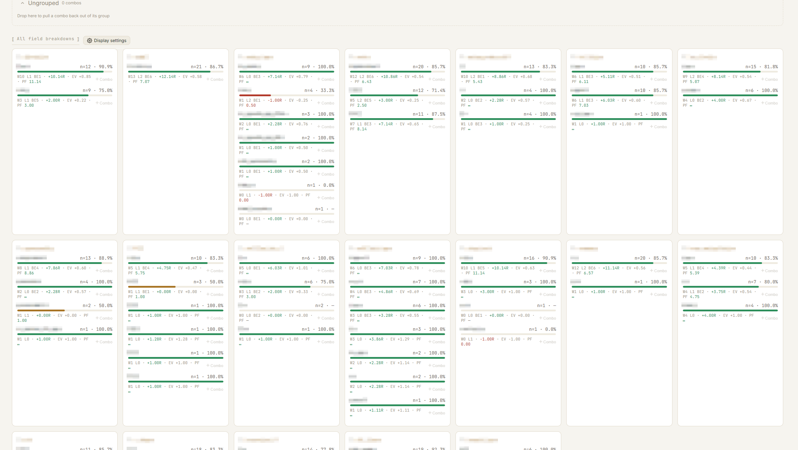
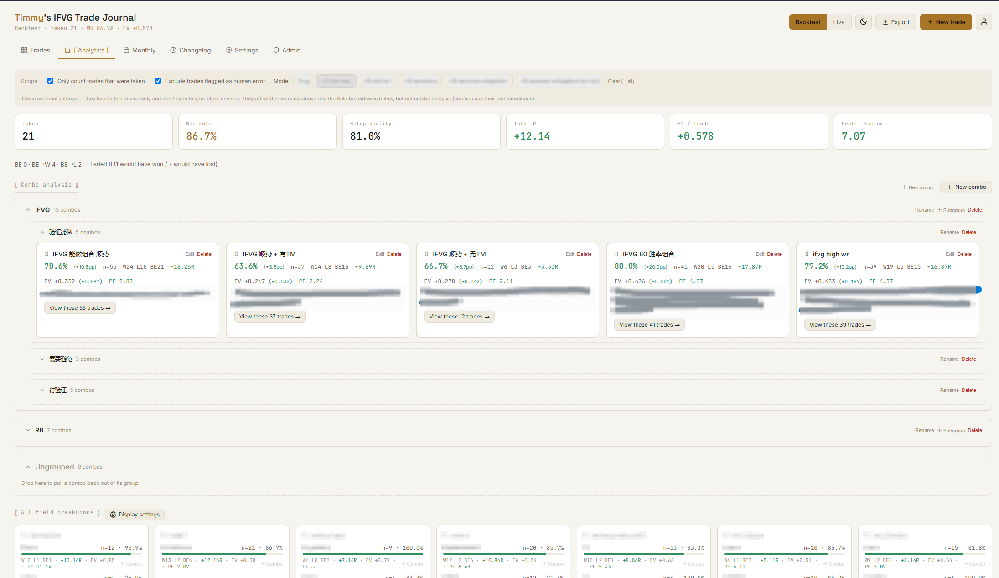
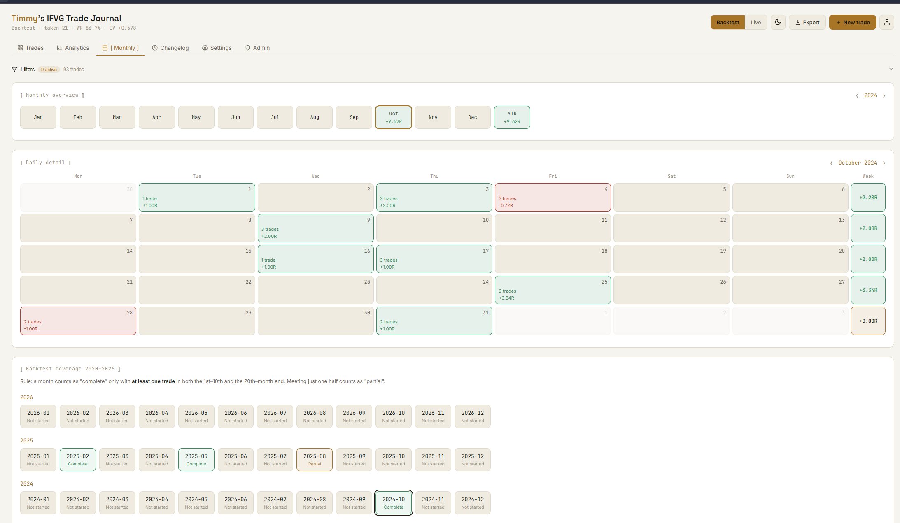
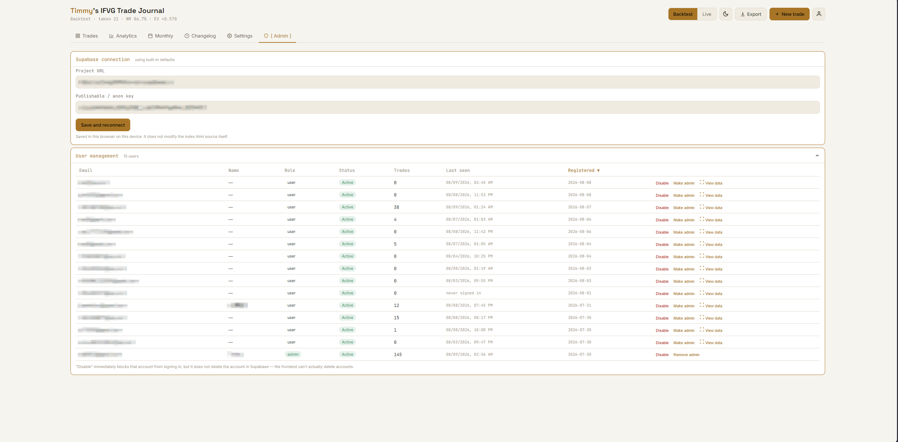

<h1 align="center">IFVG Trade Journal</h1>

<p align="center">
  A self-hosted, multi-user trading journal for traders who want their own schema —
  not whatever fields someone else's SaaS decided on.
</p>

<p align="center">
  <b>English</b> · <a href="README.zh-CN.md">简体中文</a>
</p>

<p align="center">
  
  
  
  
</p>

<!-- SCREENSHOT — hero shot (the records view with cards). Drop the file at docs/screenshots/hero.png, then delete the comment markers around the line below.
<p align="center"></p>
-->

---

## What this is

A web app for logging trades and finding out which of your own setups actually make money.

Every user gets their own field schema, their own trades, and their own analytics
configuration. Nothing is hardcoded to one trading model — the app was built around
the IFVG model, but every field, option and label is user-editable, and the analytics
engine identifies fields by the **role** you assign them, never by their name. Rename
"RR" to "R multiple" to "収益率" and every statistic keeps working.

Two fully separated data sets per account (**Backtest** and **Live**) let you build a
backtest sample of hundreds of trades without polluting your real track record.

**Key ideas**

- **Your schema, not ours** — add/remove/reorder fields, edit their type and option pool.
- **Roles over names** — the statistics engine looks for `result`, `r_multiple`, `taken`… roles.
- **Saved combos** — freeze a set of filter conditions ("Model = IFVG **and** target contains BSL"),
  name it, and watch its win rate / EV / profit factor live, next to the global baseline.
- **One consistent number everywhere** — filter bar, analytics page and combo cards share the
  same computation path, so the numbers can't drift apart.
- **Zero backend code of your own** — the browser talks to Supabase directly; row-level
  security in Postgres is the access control layer.

---

## Feature tour

### Records

<!-- SCREENSHOT — records view, table mode with the filter panel open → docs/screenshots/records.png
<p align="center"></p>
-->

- **Card view** with 3 image sizes (compact / standard / large) and a picker for which
  extra fields appear on the card. Date, model and R are always shown. Built for *finding*
  one trade among dozens.
- **Table view** — every field as a column, 25 rows per page.
- **Focus view** — one trade per row at full size, built for *reading* a trade: page through
  dozens in a row to spot patterns and build a feel for the market. Screenshots are **never
  cropped** here (card view crops to keep the grid tidy), only capped by height, with three
  height steps (comfy / large / full screen). Fields sit to the right of the chart or below it
  (below lets the chart use the full row width and get bigger, at the cost of one trade no
  longer fitting on a single screen). <kbd>J</kbd> / <kbd>K</kbd> or <kbd>↑</kbd> / <kbd>↓</kbd>
  steps between trades; click the chart for full size. A **hide-outcome** toggle covers the
  result and R so you judge the chart first and then reveal — for training your read, not for
  reviewing the books.
- **Full-text search** across text and textarea fields (notes, review notes…).
- **Filtering** — multiple fields combined with AND; multiple values inside one field
  combined with OR (switchable to AND for multiselect fields); invert a condition; date
  and time ranges; "contains" matching for text. Filter cards are drag-reorderable, and the
  filter state is persisted locally and shared between the Records and Monthly pages.
- **Live filter summary** — win rate, W/L/BE counts, total R, EV and profit factor for the
  current result set, plus a one-click "save this filter as a combo".
- **Sorting** by trade date / created / updated, ascending or descending.
- **Draft protection** — a half-filled *new* trade is saved to local storage, so closing the
  tab by accident doesn't lose it. (Edits to existing trades are not drafted, by design.)
- Screenshot URLs per trade, lazy-loaded thumbnails, click for a full-size lightbox. **TradingView snapshot links**
  (`tradingview.com/x/…`) are shown as the chart image itself; direct image links (e.g. FX Replay) work as-is.
  In the lightbox, **← / →** step through the other images on the same page (or post, or dialog), and the page
  behind scrolls along so it's sitting on the last one you looked at when you close it.

### Analytics

<!-- SCREENSHOT — analytics overview + field breakdowns → docs/screenshots/analytics.png
<p align="center"></p>
-->

**Overview tiles**

| Metric | Definition | Notes |
| --- | --- | --- |
| Trades | how many trades the analysis scope currently covers | |
| Win rate | `W / (W + L)` | BE variants are deliberately **not** in the denominator |
| Setup quality | `(W + BE→W) / (W + L + BE→W + BE→L)` | how often the idea was right, regardless of management |
| Total R | `Σ R` | |
| EV / trade | `Σ R / trades` | denominator counts every in-scope trade, including blank R |
| Profit factor | `Σ positive R / \|Σ negative R\|` | only trades with an R actually filled in; shows `∞` when there are no losses |
| Max drawdown | deepest peak-to-trough drop on the R equity curve | trades ordered by date; only those carrying an R value count |

**Analysis scope** — one filter panel at the top of the page decides which trades every number
below is computed from. It is a full filter, not a pair of switches: any field, any combination.

- It starts with a single visible condition, `taken = Taken`, so leaving the panel closed shows
  you what you actually traded.
- *Taken only* and *exclude human error* are quick buttons that **add a real condition** you can
  then see, edit or delete — never hidden logic behind a number.
- The header always carries the chain `230 → 57`: all trades on the left, the set every figure
  on the page actually uses on the right.
- It is **entirely separate from the Records and Calendar filters** — its own storage, its own
  state; editing one never touches the other. It lives per-device and does not sync.
- The overview tiles, the Faded line and every field breakdown all read from this one filtered
  set, so nothing is quietly filtered behind your back.

**Field breakdowns** — every select/multiselect field is broken down by value, with win rate,
sample size, W-L-BE, total R, EV and profit factor per value, plus **each row's delta against
the overall win rate of the current set** (`+9.2pp`) — the difference is what carries the signal,
since a high absolute rate often just means the whole set is high. The `result` field is
excluded (breaking down results by result is circular). Hide the fields you don't care about,
drag the rest into the order you want; new fields you add later automatically appear at the end
instead of being swallowed by a stale whitelist.

Because this page gets long, it folds away what carries no information:

- Values with fewer than 5 trades lose their bar and delta and collapse into a single
  "N more" row you can expand — `n = 3` at 100% should not look as convincing as `n = 80`.
- Fields holding a single value across the current scope get no card at all; their breakdown
  would be one row with a delta of exactly zero. They collapse into one line underneath.
- Rows can be sorted by count, by **distance from the overall rate**, or by EV. The middle one
  is the fastest way to find an edge.
- Multi-select fields are tagged as such: one trade lands in every value it selected, so the
  row counts legitimately add up to more than the total.
- A compact strip (n, win rate, total R, PF, max drawdown) sticks to the top as you scroll and
  jumps you between sections, so the baseline a delta refers to is never off-screen. Combos and
  breakdowns can each be collapsed as a whole.

**Combos**

<!-- SCREENSHOT — combo cards inside groups → docs/screenshots/combos.png
<p align="center"></p>
-->

A combo is a saved, named set of filter conditions with live statistics: win rate, n,
W-L-BE, total R, EV and profit factor, each shown together with its **delta against the
global baseline** (`+9.2pp`). Small samples are labelled (`n < 10`).

- **"Analyze this combo"** copies its conditions into the Analysis scope panel, so the overview
  tiles and every field breakdown then cover only that combo's trades. That is the way to drill
  in: look at a combo, find the field value that stands out inside it, refine, repeat. It is a
  copy, not a binding — edit freely without touching the combo, and write your edits back when
  you want to keep them.
- Three ways to create one: from the analytics page, from the Records filter bar
  ("save current filter as combo"), or from the `+combo` button on any breakdown row.
- Switch between **card and list view**; the list is much faster to scan once you have a dozen.
- **Groups and subgroups** — organise combos into a two-level tree (e.g. `IFVG → do / avoid`),
  collapsible, drag-and-drop between groups and drag-reorderable. Ignore groups entirely and
  it stays a flat list.
- Click a combo to jump to the Records page showing exactly the trades it matched.
- **Broken-reference guard** — if a combo references a field or option you later deleted, it is
  flagged in red and its statistics are disabled, instead of silently degrading into
  "matches every trade" and quietly looking great.

### Monthly

<!-- SCREENSHOT — month bar + daily heatmap → docs/screenshots/calendar.png
<p align="center"></p>
-->

- **Year bar** — 12 months plus a YTD cell, coloured by R, click to jump to a month.
- **Daily heatmap** — Monday-first calendar, per-day trade count and R, colour-coded, with a
  **weekly total column** on the right. Click a day for its trade list (thumbnails, result,
  R), open a trade from there, delete one, or create a new trade pre-dated to that day.
- **Historical backtest coverage** (backtest mode only) — 2020 to the current year, month by
  month, marked *complete / partial / not started*. A month counts as complete when both the
  1st–10th and the 20th–end-of-month windows contain at least one record, so you can see at a
  glance where your backtest sample has holes.
- The Records page filters apply here too.

### Reviews

Free-form posts for writing up a week — or anything else. Markdown, stored as plain text.
**Backtest and live each get their own set**, so switching mode switches the whole list and
its groups.

- **Write a post** — title, body, and an optional **day or week tag**: a Day / Week / None
  switch, with Today / Yesterday / any date under Day, and This week / Last week / any date
  under Week (which snaps to that week's Monday). The two are mutually exclusive —
  switching clears the other. Posts stay free-form: nothing forces one a day or one a week,
  and the tag can be left off entirely. "New review" defaults to today.
- **One page, what you see is what you get** — the editor works like Notion: a full-page
  sheet with a big title, and the body is already formatted as you type. There is no preview
  pane and no separate read mode; open your own post and just start writing. Type `# ` for a
  heading, `- ` for a bullet, `1. ` for a numbered list, `[] ` for a to-do (tick it right
  there), `> ` for a quote, ```` ``` ```` for a code block, `---` for a divider; `**bold**`,
  `*italic*`, `~~strike~~` and `` `code` `` convert as you close them. Enter continues a list,
  Enter on an empty item leaves it, Tab / Shift+Tab nest and un-nest. Click the empty space
  below the text to keep writing at the end.
- **Select text for the formatting bar** — bold, italic, strikethrough, inline code, link,
  colour, heading 1/2. With the cursor inside a link it offers open / edit / remove; inside a
  table it offers add / delete row and column and delete table.
- **Shortcuts** — with `Ctrl/Cmd`: `B` bold, `I` italic, `E` inline code, `K` link, `S` save
  now, `Shift+S` strikethrough, `Alt+1`/`2`/`3` headings, `Shift+8` bullets, `Shift+7`
  numbers, `Shift+9` to-do, `Shift+B` quote. `Ctrl/Cmd+Z` / `Ctrl/Cmd+Shift+Z` undo and redo
  everything, including formatting.
- **`/` insert menu** — type `/` at the start of a line or after a space (with a Chinese IME,
  `、` at the start of a line works too) for text, headings, lists, to-dos, quote, code block,
  divider, table, image, link, text colour, and **Link a trade**. It filters as you type, in
  either language (`/table` and `/表格` both work).
- **Text colour** — red, green, yellow, blue or grey, plus a highlight background. Picking
  another colour swaps it; "Clear colour" drops it. It is stored as `{red|text}` and the
  colours follow the light/dark theme.
- **Images live on an external image host, never in the database.** Insert one with
  `/image` and its URL, or paste a bare image link. Pasting an image file directly only shows
  a reminder to upload it to an image host first. Double-click an image for the lightbox.
- **Pasting markdown** from elsewhere (notes, another tool) is formatted on the way in.
- **Linked trades** — pick a trade from the picker (searchable by date, model, anything) and
  it drops a `[[trade:…]]` reference at the cursor. It renders as a pill showing date, model,
  result and R. **Clicking it opens a read-only preview** — the screenshot uncropped plus
  every field that trade has filled in, not an edit form; click the image for the full size,
  and there's an explicit "Edit this trade" at the bottom if you actually want to change it.
  Reading a review is reading, and a form full of inputs one click away is both heavy and
  easy to change by accident. If the trade is later deleted, the pill turns
  red and says so rather than silently vanishing.
- **Groups** — make as many named groups as you like (one level, no nesting) and drag posts
  into them. Weekly write-ups can just sit in Ungrouped in date order, while collections you
  keep adding to — recurring mistakes, ideas to test — get a group each. Group headers drag
  to reorder, cards drag to reorder within a group or to move between groups. Every group
  header has a "New here" button; posts started there land in that group and are not tagged
  to a week. **Deleting a group does not delete the posts inside** — they go back to
  Ungrouped.
- **Autosave** — writes 1.2 s after you stop typing, with a saved/unsaved indicator, a local
  draft as a fallback, and a warning if you close the tab mid-save.

Collapsed/expanded state is per device (and per mode); group names and order follow the account.

### Settings

Manage the field schema: rename fields, change their type, edit the option pool
(drag-to-reorder), assign an analysis role, retire, delete, and drag whole fields into a new
order. Changes take effect immediately in the entry form and across all statistics.

**Retiring a field (reversible)** — expand any field and hit "Retire this field". Once retired:

- it disappears from the entry form, and new trades are simply blank there;
- nothing already stored is touched — breakdowns, combos, filters and exports still see it;
- editing an older trade that *did* fill it in shows those values in their own section at the
  bottom of the form, still editable;
- "Collect again" brings it straight back.

Any long-running schema ends up with a few fields the breakdowns have proven carry no signal,
and filling those in on every trade is pure cost. But **deleting** one also destroys the very
evidence that proved it useless — that breakdown can never be re-checked. So retire whenever
the goal is "stop filling this in", and keep deletion for fields that were a mistake to begin
with. Retiring a field that carries a core role (date / result / R) asks for confirmation
first, since new trades would then skew every statistic from the next entry on.

**Field types:** `text` · `textarea` · `number` · `date` · `time` · `select` · `multiselect` · `url`

**Analysis roles** — assign at most one field to each; this is the only thing the statistics
engine looks at, so field names are yours to choose freely:

| Role | Used for |
| --- | --- |
| `date` | calendar, monthly coverage, sorting |
| `model` | per-model breakdown |
| `taken` | `Taken` / `Faded` — the default analysis scope filters on this |
| `result` | `W` / `L` / `BE` / `BE -> W` / `BE -> L` — required for any analytics at all |
| `r_multiple` | total R, EV, profit factor, max drawdown |
| `max_rr` | nothing any more — kept only so older schemas that use it stay valid |
| `human_error` | the "exclude human error" quick condition |
| `screenshot` | card thumbnails and the lightbox |

New to the app? [docs/new-user-guide.md](docs/new-user-guide.md) walks through every default
field and — importantly — which parts you can safely rename versus which parts will silently
break your statistics if you edit them.

### Account

Email + password sign-up and sign-in, optional "stay signed in" (switches the session store
between `localStorage` and `sessionStorage`), change password with current-password
verification, custom display name (used in the page title) and gender.

### Language

English and Chinese, switchable from the account menu in the top-right **and** from the
sign-in screen (so you can pick a language before you have an account). First visit picks it
from `navigator.language`; after that the choice is stored on your profile, so signing in on
another device gets the same language.

Two things are deliberately *not* translated:

- **Your field names.** A new account's default fields are seeded in whatever language was
  active at signup — `Date` / `Session` / `Entry Time` in English, `日期` / `交易时段` /
  `入场时间` in Chinese. After that they're your data. Switching language changes the
  interface around them but never rewrites labels you may have renamed. To change them,
  edit the fields in Settings.
- **Option values** (`London`, `Taken`, `W`/`L`/`BE`, …). These are stored in the database
  and shared by both languages, so statistics stay comparable no matter which language a
  trade was entered in.

Language sync needs one migration — see [`supabase/migrations`](supabase/migrations) (`20260901000000_journal_features.sql`).
Without it the app still works and remembers your language per browser; it just won't follow
you across devices.

### Admin panel *(admin role only)*

<!-- SCREENSHOT — admin user table → docs/screenshots/admin.png
<p align="center"></p>
-->

- Supabase connection override, stored per browser (never writes back to the source files).
- **User management** — disable/enable an account (a disabled user is kicked out on next
  load), grant/revoke admin, and a sortable table of trade count, last seen and signup date.
- **Read-only inspection of any user's data** — browse someone else's trades, schema and
  analytics without touching your own session or local settings; exiting restores your state.
- Publish and delete changelog entries, which every signed-in user sees on the Changelog tab.

### Everything else

Dark and light theme, CSV export, JSON backup export, lazy-loaded images, `Esc` closes the
topmost modal or lightbox, responsive layout.

---

## Tech stack

| Layer | Choice |
| --- | --- |
| Frontend | Static files — `index.html` + `style.css` + `i18n.js` + `app.js`. No framework, no bundler, no build step. |
| Backend | [Supabase](https://supabase.com) (Postgres + Auth), called directly from the browser via `supabase-js`. |
| Hosting | Any static host. `vercel.json` + `build.js` are included for Vercel. |

**Architecture in three sentences.** All state lives in module-level `let` variables; mutating
state and calling `render()` regenerates an HTML string into `#app`. All interaction goes
through `data-action="…"` attributes and a handful of delegated listeners on `document`,
rather than per-element handlers. Modals render into `#modalRoot` / `#secondaryModalRoot` and
have re-render guards so a background refresh can never wipe out something you're typing.

If you plan to contribute, read [PROJECT_HANDOFF.md](PROJECT_HANDOFF.md) first — it documents
the conventions, the traps (notably: **never wrap a container that holds buttons in
`stopPropagation()`** — it silently kills every child action) and the post-change checks.

### Data model

| Table | Purpose |
| --- | --- |
| `profiles` | one row per user — email, role (`user`/`admin`), active flag, display name, gender, language, last seen. Created automatically by a signup trigger. |
| `trades` | one row per trade — `mode` (`backtest`/`live`) plus a `jsonb` `data` blob keyed by field id, so adding a field never needs a migration. |
| `journal_schema` | per-user config — `fields` (the schema), `card_fields`, and `analysis_prefs` (breakdown order/visibility, combos, combo groups). |
| `changelog` | global, shared by all users; admin-only writes. |
| `journal_reviews` | one row per review post — markdown `body`, optional `week_start`, and `linked_trade_ids` (a denormalised index of the `[[trade:…]]` references in the body). |

Row-level security is what enforces isolation: users read and write only their own rows,
admins additionally get **read-only** access to everyone's. Privileged writes go through
`security definer` functions (`update_own_profile`, `update_own_lang`, `touch_last_seen`,
`is_admin`) so the client can never escalate its own role.

---

## Getting started

### 1. Supabase project

Create a project, then apply the SQL in [`supabase/migrations/`](supabase/migrations) **in
filename order** (Supabase dashboard → SQL Editor, or `supabase db push` with the CLI):

| File | What it does |
| --- | --- |
| `20260804000000_baseline.sql` | The four base tables (`profiles`, `trades`, `journal_schema`, `changelog`), RLS policies, and the `security definer` helpers. **Fresh projects only** — it was reconstructed from [PROJECT_HANDOFF.md](PROJECT_HANDOFF.md) §3, not diffed against a live database. On an existing deployment mark it applied instead: `supabase migration repair --status applied 20260804000000`. |
| `20260901000000_journal_features.sql` | Language sync, focus mode, analytics prefs, and the whole Reviews feature (table, backtest/live split, groups, daily reviews). Idempotent. |
| `20260929000000_scale.sql` | A `trades` index for the paged loader, and `admin_trade_counts()` so the admin panel counts trades in the database. Idempotent. |

The frontend does **not** degrade around a missing table or column any more: if the database is
older than the code, a banner tells you to run the migrations. The first admin is promoted by
hand (`update profiles set role = 'admin' where email = '…'`).

### 2. Run it locally

```bash
cp config.example.js config.js
```

Fill in your Project URL and anon/publishable key from **Supabase dashboard → Settings →
API**, then serve the folder over HTTP (auth won't work from `file://`):

```bash
npm run bundle   # src/*.js → app.js (re-run after edits, or `npm run dev` to watch)
python -m http.server 8000
```

Open <http://localhost:8000>. There is nothing to install and nothing to compile.

### 3. Deploy to Vercel

`config.js` is gitignored, so the build generates it from environment variables:

1. **Import Git Repository** → this repo → Framework Preset **Other**.
2. **Settings → Environment Variables** → add `SUPABASE_URL` and `SUPABASE_ANON_KEY`.
3. Push to the default branch; every push redeploys.

Any other static host works too — just upload the folder with a hand-written `config.js`.

---

## Security model

- The anon/publishable key in `config.js` **is designed to be public** — that's Supabase's own
  documented position. Anyone can read it from your page source; that is not a vulnerability.
- The real security boundary is the **RLS policy on every table**. When you add a table or a
  feature, the question to ask is "is the policy right?", not "is the key hidden?".
- **Never** put a `service_role` / secret key anywhere in frontend code. That key bypasses
  every RLS policy and is effectively full database access.

### Free-tier operations note

Supabase's free plan pauses a project after 7 days without database activity (data is kept,
but 90 days of continuous pause releases the infrastructure) and provides **no automatic
backups**. This project's answer is a separate private repository running a scheduled GitHub
Action that `pg_dump`s the database daily into a committed `latest-backup.sql`, which gives
both point-in-time history via git and enough activity to prevent the pause. Connect through
the **Session pooler** connection string rather than the direct connection — the direct one
prefers IPv6 and often fails from CI.

---

## Known limitations

- No automated test suite. Verification is manual plus `node --check` and a `data-action`
  cross-reference grep (see [PROJECT_HANDOFF.md](PROJECT_HANDOFF.md) §4).
- The admin "inspect another user's data, then restore my own state" path has not been fully
  exercised end to end in a real browser.
- `max_rr` no longer drives anything. It used to feed the R capture rate, which max drawdown
  replaced; the role is kept so schemas already using it do not end up with an unrecognised
  value in the role dropdown.
- `app.js` is a single large file with no module split — fine for one maintainer, friction for
  a team.
- Accounts can be disabled but not deleted from the admin panel; deleting the underlying auth
  user requires the Supabase dashboard (a frontend cannot be trusted with that).

---

## License

No open-source license is attached. All rights reserved.
